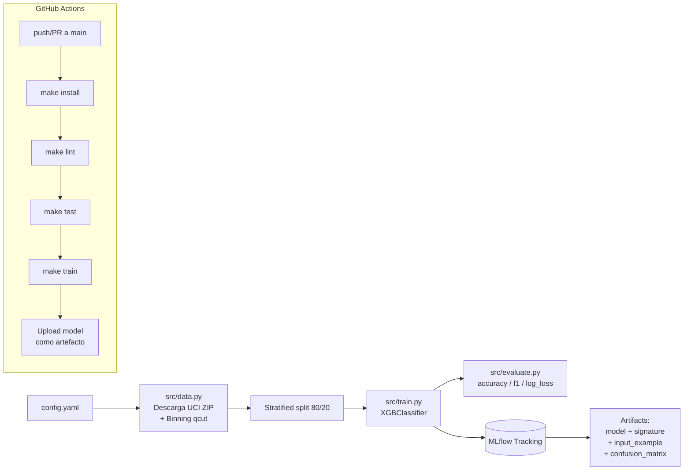

# Proyecto MLOps — Bike Demand Classification

[](https://github.com/cqdirecly/EAN_MLOPS_Proyecto_Final/actions/workflows/ml.yml)

Pipeline reproducible de Machine Learning con tracking en **MLflow** y CI/CD automatizado en **GitHub Actions**. Predice el **nivel de demanda de bicicletas compartidas** (Low/Medium/High/VeryHigh) por hora a partir de variables temporales y meteorológicas.

---

## 1. Dataset

- **Nombre**: Bike Sharing Dataset (hourly).
- **Fuente**: UCI Machine Learning Repository — paper de Fanaee-T & Gama (2014).
- **URL oficial**: https://archive.ics.uci.edu/dataset/275/bike+sharing+dataset
- **Filas**: 17,379 horas entre 2011-01-01 y 2012-12-31.
- **Justificación**: Es un dataset de fuente libre (UCI), bien documentado, con variables temporales y meteorológicas que permiten construir un problema multiclase realista mediante discretización del conteo de alquileres por hora.

### Conversión a multiclase (binning)
La columna original `cnt` (alquileres por hora, entero 1–977) se discretiza en **4 niveles** usando `pd.qcut` con cuartiles:

| Clase | Etiqueta | Rango aproximado |
|---|---|---|
| 0 | Low | 1 – 40 |
| 1 | Medium | 41 – 142 |
| 2 | High | 143 – 281 |
| 3 | VeryHigh | 282 – 977 |

`qcut` garantiza ~25% de muestras por clase (dataset balanceado).

### Eliminación de leakage
Las columnas `casual`, `registered` y `cnt` se eliminan del input porque `cnt = casual + registered`. También se eliminan `instant` (ID) y `dteday` (fecha cruda).

---

## 2. Arquitectura



---

## 3. Estructura del repositorio

├── .github/workflows/ml.yml    # Pipeline CI/CD
├── src/
│   ├── data.py                 # Carga UCI + binning + preprocesamiento
│   ├── evaluate.py             # Métricas multiclase + matriz confusión
│   ├── train.py                # Pipeline + XGBoost + MLflow
│   └── utils.py                # Helpers (config, logging)
├── tests/
│   └── test_pipeline.py        # 9 tests unitarios
├── data/                       # CSV cacheado y muestra sintética
├── config.yaml                 # Hiperparámetros y rutas
├── Makefile                    # Tareas reproducibles
├── requirements.txt
└── README.md

---

## 4. Instalación

```bash
git clone https://github.com/cqdirecly/EAN_MLOPS_Proyecto_Final.git
cd EAN_MLOPS_Proyecto_Final

python -m venv .venv
# Windows
.venv\Scripts\activate
# Linux/Mac
source .venv/bin/activate

pip install -r requirements.txt
```

Requiere Python 3.10+.

---

## 5. Uso

| Comando local | Equivalente | Qué hace |
|---|---|---|
| `python -m src.train` | `make train` | Pipeline completo (data + train + MLflow) |
| `python -m pytest tests/ -v` | `make test` | 9 tests unitarios |
| `python -m flake8 src/ tests/ --max-line-length=110` | `make lint` | Lint con flake8 |
| `python -m mlflow ui` | `make mlflow-ui` | UI en `http://127.0.0.1:5000` |

> En Windows sin `make` instalado, usa los comandos directos. En GitHub Actions (Ubuntu) se usan los del Makefile.

---

## 6. Resultados

Métricas obtenidas con XGBoost (300 árboles, max_depth=6, learning_rate=0.1) sobre 17,379 filas con stratified split 80/20:

| Métrica | Valor TEST |
|---|---|
| Accuracy | 0.8285 |
| F1 macro | 0.8289 |
| Precision macro | 0.8297 |
| Recall macro | 0.8284 |
| Log loss | 0.4266 |

Random esperaría ~25% (4 clases balanceadas). El modelo logra **3.3× mejor** que random.

---

## 7. Evidencia MLflow

Cada run registra:
- **Parameters**: 19 valores (`n_estimators`, `max_depth`, `bin_edges`, `n_classes`, etc.).
- **Metrics**: 9 métricas (5 train + 4 test + log_loss).
- **Signature** inferida con `infer_signature`.
- **Input example** con 5 filas representativas.
- **Modelo registrado** en el Model Registry como `BikeDemandXGBClassifier`.
- **Artefactos extra**: `confusion_matrix.json`, `features.json`.

Capturas de los runs se incluyen en la entrega del proyecto.

---

## 8. CI/CD con GitHub Actions

El workflow `.github/workflows/ml.yml` se dispara en cada `push`/`pull_request` a `main` y ejecuta:
1. Checkout.
2. Python 3.10 con caché de pip.
3. `make install` → dependencias.
4. `make lint` → flake8.
5. `make test` → 9 tests.
6. `make train` → pipeline + MLflow.
7. **Upload de artefactos**: `model.pkl`, `metrics.json`, `features.json`, `confusion_matrix.json`, y `mlruns/`.

Ver runs: [Actions tab](https://github.com/cqdirecly/EAN_MLOPS_Proyecto_Final/actions).

---

## 9. Autor

**Christian Quimbay** — **CC:80188132**
proyecto académico CI/CD para la asignatura MLOps y analitica en la Nube.